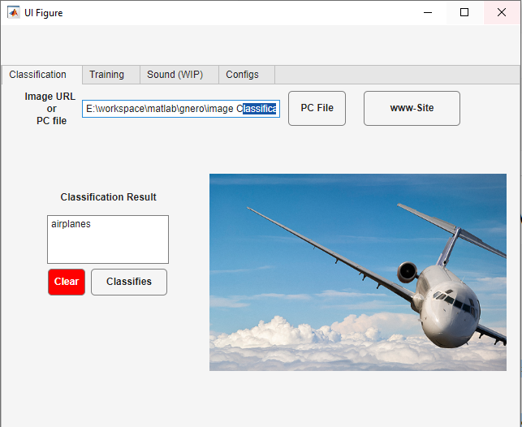
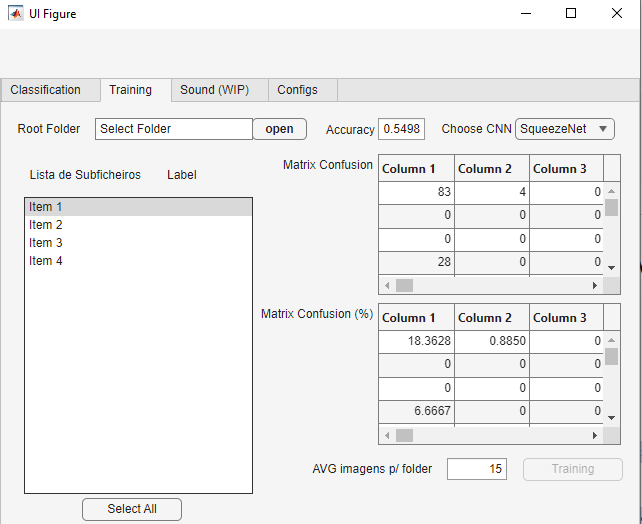
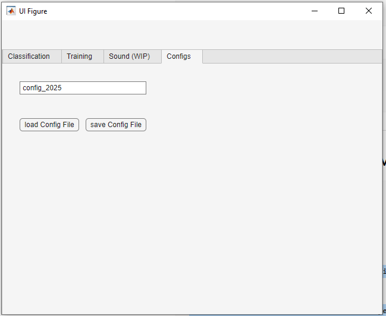

# Image Classification Neural Network (MATLAB)

## Overview
This project implements a neural network in MATLAB for image classification. The system supports classification of images from local files and direct URLs, enabling flexible real-world usage. In addition, the trained model generates a configuration file containing learned parameters, which can be reused in other applications as a base classifier.

---

## Application Interface

### Classification Interface

This interface allows users to classify images either from a local file or directly from a URL. The system displays the classification result and the corresponding image.

---

### Training Interface

The training panel enables dataset selection, neural network training, and performance evaluation. It includes accuracy metrics and confusion matrix visualization.

---

### Configuration Management

Users can save and load trained model configurations, allowing reuse of trained parameters in future applications.

---

## Features
- Image classification from local computer files
- Image classification using direct image URLs (internet input)
- Neural network training and validation using labeled datasets
- Export of trained model parameters (configuration file) for reuse in other systems
- Modular design for integration into external applications

---

## Objectives
- Develop a neural network for image recognition in MATLAB
- Enable flexible image input sources (local + web)
- Train and validate the model using supervised learning
- Export learned parameters for reuse and deployment scenarios
- Evaluate classification performance under different conditions

---

## Technologies
- MATLAB
- Neural Networks Toolbox
- Image Processing Toolbox (if applicable)

---

## Methodology
The system follows a supervised learning approach. Images are preprocessed and converted into numerical representations before being fed into the neural network. The model is trained using a labeled dataset and validated using a separate test set.

After training, the system allows:
- Classification of images from local storage
- Classification of images from online sources via URL input
- Export of trained weights and configuration parameters for reuse in external applications

---

## Model Output
The trained model generates a configuration file containing:
- Network weights
- Model parameters
- Classification settings

This file can be reused as a pre-trained base for other classification systems.

---

## Results
The model demonstrates the ability to classify images with good performance depending on dataset quality and training parameters. The system is optimized for flexible input handling and model reuse.

---

## Future Improvements
- Implementation of convolutional neural networks (CNNs)
- Support for larger and more diverse datasets
- Improved accuracy through hyperparameter tuning
- Deployment as a standalone MATLAB or Python service

---

## Example Usage
- Load local image for classification
- Provide image URL for remote classification
- Export trained model configuration for reuse

---

## Author
Cláudio Jorge
